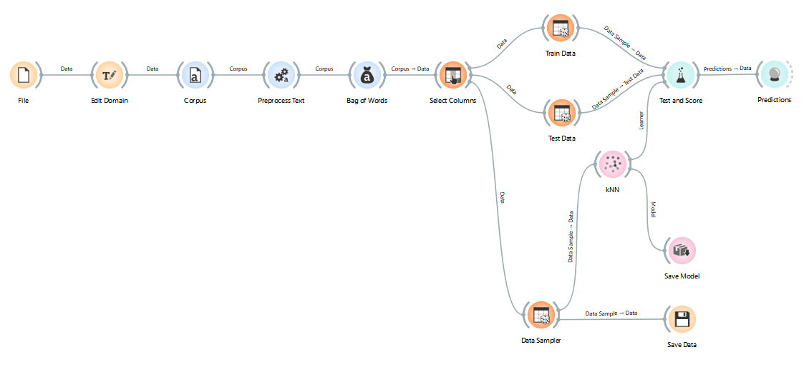

# text-mining
TODO:
- [x] konversi dataset agar mudah penerapannya dalam proses klasifikasi pertanyaan - jawaban
- [x] pre-processing data (olah kalimat pertanyaan menjadi token)
- [x] pembobotan pertanyaan (metode? TF-IDF)
- [x] olah data dan simulasi menggunakan **orange data mining**
- [x] metode proses pertanyaan dan pencocokan dengan dataset
- [x] implementasi kode untuk model training
- [ ] optimasi dataset (menyeimbangkan dataset agar menghasilkan model dengan akurasi lebih baik)
- [ ] implementasi rumus menjadi kode program
- [ ] optimasi kode program

ODM Workflow:

